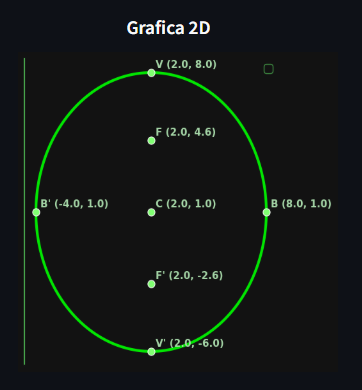
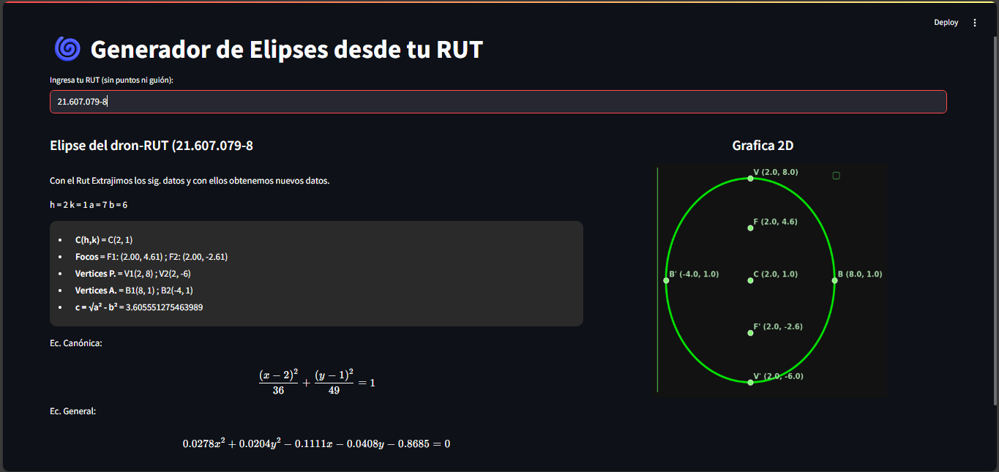

# Sistema de Monitoreo de Drones

  
   
  <i>Simula la trayectoria de un dron a través del RUT ingresado</i>

## 📝 Contexto del proyecto 
En la Universidad Católica de Temuco, se investigan trayectorias seguras para drones en entornos urbanos como eventos masivos o inspecciones de estructuras civiles.

Estas trayectorias se modelan mediante secciones cónicas (elipses), asociadas al RUT del operador, con el fin de garantizar seguridad y eficiencia en misiones autónomas.

El proyecto está a cargo de estudiantes de Ingeniería Civil Informática, quienes deben diseñar, simular y validar dichas trayectorias, aplicando geometría analítica, programación y modelado matemático. El desarrollo se organiza por fases, integrando teoría y práctica.

## 👷 ¿Qué tiene ahora? (Avance)

Actualmente se ha desarrollado la funcionalidad de cálculo de una elipse a partir de un RUT en `app/core/elipse.py`.

Se implementa programación orientada a objetos (POO), separando la lógica de operaciones de la visualización.

En esta versión 1.0, la aplicación permite:
- Ingresar un RUT y generar una elipse asociada.
- Mostrar los elementos derivados de esa elipse.
- Realizar todos los cálculos manualmente (sin utilizar librerías como `math`).  
  → Ver más en [`docs/elipse.md`](docs/elipse.md)
- Mostrar grafica 2D con los puntos

> **Nota:** Hemos hecho una última actualización , la cual mejoramos interfaz e implementamos gráfica 2D.
---

  
   
  <i>Ingreso de RUT (solo uno por ahora)</i>

  
   
  <i>Implementación de grafica 2D</i>

  
   
  <i>Este es nuestro diseño actual </i>

## 🔧 Trabajo a implementar

Se proyecta desarrollar una aplicación con estructura avanzada, que ofrezca una interfaz amigable y funcional para los usuarios, permitiendo validar los datos de forma clara y segura.

## 🧰 Herramientas utilizadas (por ahora)

**Backend:** Python 3.8+

**Librerías:**
- **Streamlit**: Interfaz web rápida y elegante.
- **Matplotlib**: Gráficos 2D.
- **Plotly**: Gráficos 3D interactivos.
- **Pydantic**: Validación robusta de datos (como entradas de RUT, parámetros, etc.).
- **Pytest**: Pruebas automáticas de funciones.
- **Numpy**: Cálculos numéricos y manejo de vectores.
- **Scipy**: Cálculos de colisión y precisión matemática.

> **Nota:** Inicialmente se utilizarán Numpy y Scipy para facilitar validaciones, pero en etapas posteriores se eliminarán para implementar los cálculos manualmente y reforzar la comprensión matemática.

## 👨‍💻 MAT1186

Proyecto desarrollado para la asignatura **MAT1186 - Introducción al Cálculo**, implementando operaciones de elementos canónicos sin depender de bibliotecas matemáticas externas, con el objetivo de reforzar los conceptos teóricos mediante su aplicación práctica.

---

  
<strong>Versión 1.1</strong> - Primer prototipo funcional

