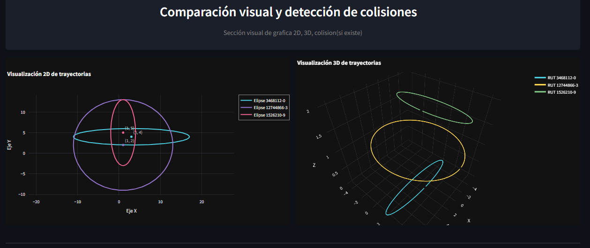
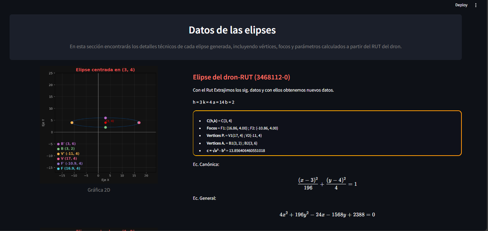

# Sistema de Monitoreo de Drones

  
   
  <i>Simula la trayectoria de un dron a través del RUT ingresado</i>

## 📝 Contexto del proyecto 
En la Universidad Católica de Temuco, se investigan trayectorias seguras para drones en entornos urbanos como eventos masivos o inspecciones de estructuras civiles.

Estas trayectorias se modelan mediante secciones cónicas (elipses), asociadas al RUT del operador, con el fin de garantizar seguridad y eficiencia en misiones autónomas.

El proyecto está a cargo de estudiantes de Ingeniería Civil Informática, quienes deben diseñar, simular y validar dichas trayectorias, aplicando geometría analítica, programación y modelado matemático. El desarrollo se organiza por fases, integrando teoría y práctica.

## 👷 ¿Qué tiene ahora? (Avance)

Actualmente se ha desarrollado la funcionalidad de cálculo de múltiples elipses asociadas a RUTs, con lógica matemática implementada en `app/core/Match_ellipse.py`.

Se utiliza programación orientada a objetos (POO), separando la lógica matemática de la visualización e interfaz.

En esta versión 3.0, la aplicación permite:
- Ingresar uno o más RUTs (máximo 5).
- Generar elipses asociadas a cada RUT.
- Mostrar los elementos derivados de cada elipse.
- Calcular las coordenadas de manera manual (sin librerías externas como `math`).
- Visualizar gráficamente las elipses en:
  - Gráfica 2D individual.
  - Gráfica 2D múltiple.
  - Gráfica 2D/3D interactiva.
- Detectar colisiones entre elipses.
- Generar RUT aleatorio.
- Mejoras visuales en las gráficas.
- Separación y organización de componentes visuales en `app/core/components/`.
- Estructura de carpetas modular para facilitar mantenimiento y escalabilidad.
- Documentación inicial en `app/docs/`.
- Carpeta `test/` para testear los módulos de `core/`.

---

### 📌 Notas

- **Actualización a versión 3.0**: Se integran mejoras en las gráficas 2D y 3D, organización del código y corrección de bugs generales.
- **Corrección pendiente**: Detectar y resolver errores en la lógica de colisiones.
- **Implementación futura**: Agregar simulación con cambio de coordenadas de forma manual.
- **Punto de entrada**: La ejecución comienza desde `app.py`, que carga los componentes de visualización e interfaz, utilizando las funciones matemáticas del directorio `core/` y los elementos visuales del módulo `components/`.

---

### 🖼️ Nuevas imágenes

  
   
  <i>Ingreso de RUT (De 1 a 5 máx.)</i>

  
   
  <i>Pestañas disponibles</i>

  
   
  <i>Pestaña 2: Gráficas múltiples 2D/3D con interacción (vs 3.0)</i>
  

  
  <i>Pestaña 1: Gráfica 2D con ecuaciones corregidas (vs 3.0)</i>
  
   
  

## 🔧 Trabajo a implementar

Se proyecta desarrollar una aplicación con estructura avanzada, que ofrezca una interfaz amigable y funcional para los usuarios, permitiendo validar los datos de forma clara y segura.

## 🧰 Herramientas utilizadas (por ahora)

**Backend:** Python 3.8+

**Librerías:**
- **Streamlit**: Interfaz web rápida y elegante.
- **Matplotlib**: Gráficos 2D.
- **Plotly**: Gráficos 3D interactivos.
- **Pydantic**: Validación robusta de datos (como entradas de RUT, parámetros, etc.).
- **Pytest**: Pruebas automáticas de funciones.
- **Numpy**: Cálculos numéricos y manejo de vectores.
- **Scipy**: Cálculos de colisión y precisión matemática.

> **Nota:** Inicialmente se utilizarán Numpy y Scipy para facilitar validaciones, pero en etapas posteriores se eliminarán para implementar los cálculos manualmente y reforzar la comprensión matemática.

## 👨‍💻 MAT1186

Proyecto desarrollado para la asignatura **MAT1186 - Introducción al Cálculo**, implementando operaciones de elementos canónicos sin depender de bibliotecas matemáticas externas, con el objetivo de reforzar los conceptos teóricos mediante su aplicación práctica.

---

  
<strong>Versión 1.1</strong> - Primer prototipo funcional

